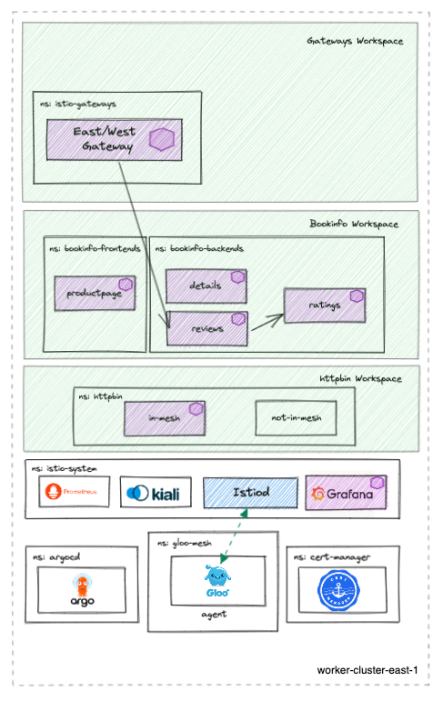

# aoa-cluster2
This repo provides a multitenant capable GitOps workflow structure that can be forked and used to demonstrate the deployment and configuration of a multi-cluster mesh demo as code using the Argo CD app-of-apps pattern.

# versions
- prod:
    - gloo mesh 2.1.0-beta27
    - istio 1.13.4
    - revision: 1-13
- qa:
    - gloo mesh 2.1.0-beta27
    - istio 1.14.3
    - revision: 1-14
- dev:
    - gloo mesh 2.1.0-beta28
    - istio 1.15.0
    - revision: 1-15

# Prerequisites 
- mgmt cluster deployed with gloo mesh installed. start with link above if needed
- 1 Kubernetes Cluster
    - This demo has been tested on 1x `n2-standard-4` (gke), `m5.xlarge` (aws), or `Standard_DS3_v2` (azure) instance for `mgmt` cluster

This repo is meant to be deployed along with the following repos to create the entire High Level Architecture diagram below.
- https://github.com/ably77/aoa-mgmt
- https://github.com/ably77/aoa-cluster1

# High Level Architecture


# What this repo deploys


# Getting Started
Run:
```
./deploy.sh $gloo_mesh_version $environment_overlay $cluster_context 
```
The script will prompt you for input if not provided

## Variables
You can configure parameters used by the script in the `vars.txt`. This is particularily useful if you want to test an alternate repo branch or if you fork this repo.
```
gloo_mesh_version=${1:-""}
environment_overlay=${2:-""} # prod, qa, dev, base
cluster_context=${3:-cluster2}
mgmt_context=${4:-mgmt}
github_username=${5:-ably77}
repo_name=${6:-aoa-cluster2}
target_branch=${7:-HEAD}
```

Note:
- Although you may change the contexts where apps are deployed as describe above, the Gloo Mesh and Istio cluster names will remain stable references (i.e. `mgmt`, `cluster1`, and `cluster2`)

# App of Apps Explained
The app-of-apps pattern uses a generic Argo Application to sync all manifests in a particular Git directory, rather than directly point to a Kustomize, YAML, or Helm configuration. Anything pushed into the `environment/<overlay>/active` directory is deployed by it's corresponding app-of-app

If you are curious to learn more about the pattern, Christian Hernandez from CodeFresh has a solid blog describing at a high level the pattern I'm using here in this repo
(https://codefresh.io/blog/argo-cd-application-dependencies/)

# forking this repo
Fork this repo and replace the variables in the `vars.txt` github_username, repo_name, and branch with your own

From there should be able to deploy and sync the corresponding `environment` waves as is in your forked repo or push new changes to it
